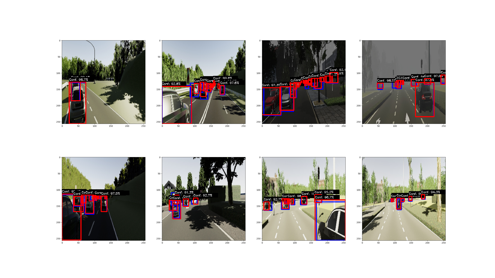

# DAC-DC : Divide and Concquer for Detection and Classification


This is a modified version of YOLO for performing 2D object detection and tracking. The model was trained and tested on several datasets and seems to be performing quite well. The results shown here are for virtualKITTI dataset across multiple weather conditions and camera positions.


*Figure 1: Result of DAC-DC on virtualKITTI dataset. Blue boxes are ground-truth, and red boxes are predictions*

## 01. Environment  

It is recommended to use a conda environment for working with DAC-DC. Requirements can be installed using ```dacdc-env.yml``` as follows:

 ```
 conda env create -f dacdc-env.yml
 ```

## 02. Data Label Format

 - DAC-DC uses 7 classes and are defined in ```config/labels.txt```
  ```
  00 Car
  01 Van
  02 Truck
  03 Pedestrian
  04 Cyclist
  05 Misc
  06 Unknown
  ```  

 - DAC-DC defines labels in the following format:
  ```
  <img1_relative_path> <num_bboxes> <class_1> <x_min_1> <y_min_1> <x_max_1> <y_max_1> <class_2> <x_min_2> <y_min_2> <x_max_2> <y_max_2> ...
  <img2_relative_path> <num_bboxes> <class_1> <x_min_1> <y_min_1> <x_max_1> <y_max_1> <class_2> <x_min_2> <y_min_2> <x_max_2> <y_max_2> ...
  .
  .
  .
  <imgN_relative_path> <num_bboxes> <class_1> <x_min_1> <y_min_1> <x_max_1> <y_max_1> <class_2> <x_min_2> <y_min_2> <x_max_2> <y_max_2> ...
  ```

 - Data Label preparation scripts are provided for KITTI and vKITTI dataset in ```src/data_prep/```

## 03. Run the demo using pretrained weights  

 - Download the dataset. 
    ```
    wget http://download.europe.naverlabs.com//virtual_kitti_2.0.3/vkitti_2.0.3_rgb.tar
    ```

 - Extract the dataset. 
    ```
    tar -xvf vkitti_2.0.3_rgb.tar
    ``` 

 - Download the pretrained weight (Needed for testing or loading the pretrained weights for transfer learning). 
    ```
    wget https://drive.google.com/file/d/1AeXCO9SwWkr3fz7n9kf35zG7zMhDDgrW/view?usp=sharing
    ```

 - Modify data path in ```src/demo.py``` to point to the downloaded dataset.

 - Run the demo script ```src/demo.py```

## 04. Train/Test DAC-DC on virtualKITTI dataset

 - Download the dataset. 
    ```
    wget http://download.europe.naverlabs.com//virtual_kitti_2.0.3/vkitti_2.0.3_rgb.tar
    wget http://download.europe.naverlabs.com//virtual_kitti_2.0.3/vkitti_2.0.3_textgt.tar.gz
    ```

 - Extract the dataset. 
    ```
    tar -xvf vkitti_2.0.3_rgb.tar
    tar -xvf vkitti_2.0.3_textgt.tar.gz
    ```

 - Generate the data labels in DAC-DC format using the script ```src/data_prep/vKITTI2DACDC.py```.  

 - Download the pretrained weight (Needed for testing or loading the pretrained weights for transfer learning). 
    ```
    wget https://drive.google.com/file/d/1AeXCO9SwWkr3fz7n9kf35zG7zMhDDgrW/view?usp=sharing
    ```

 - Modify the data path of dataset in ```config/config.ini``` by changing the line ```DATA_PATH = ``` 

 - Modify the label text file in ```config/config.ini``` by changing the line ```ANNOTATION_FILE = ```

 - Modify the pretrained weight file path in ```config/config.ini``` by changing the line ```PRETRAINED_WEIGHT_FILE = ``` 

 - If loading weights for transfer learning, set ```USE_PRETRAINED_WEIGHTS = TRUE``` in ```config/config.ini```

 - Train the network. 
    ```
    python trainModel.py
    ```

 - Train the network. 
    ```
    python testModel.py
    ```

## 05. KITTI Object Detection Dataset

 - Download the dataset and labels
   ```
   wget https://s3.eu-central-1.amazonaws.com/avg-kitti/data_object_image_2.zip
   wget https://s3.eu-central-1.amazonaws.com/avg-kitti/data_object_label_2.zip
   ```

 - Extract the dataset

 - Generate the data labels in DAC-DC format using the script ```src/data_prep/KITTI2DACDC.py```.  